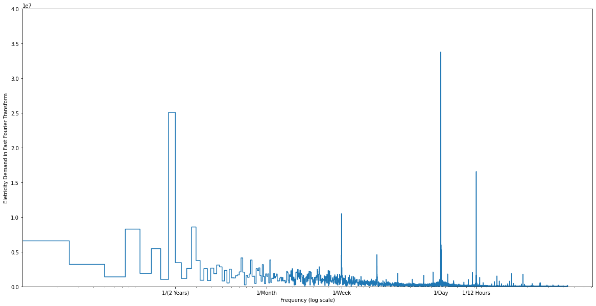
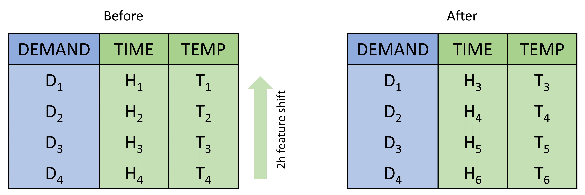
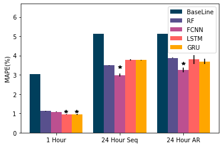
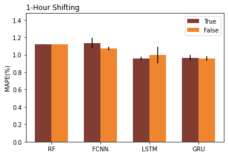
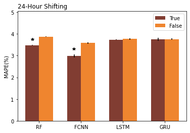
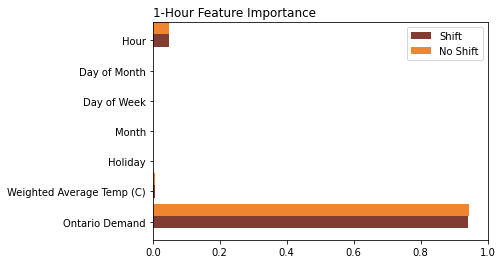
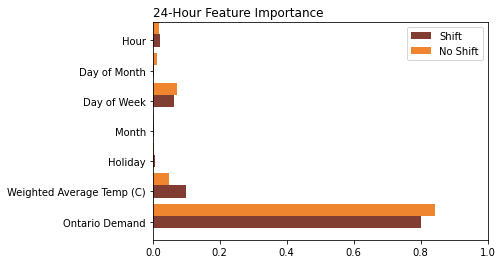

# Predict-Electricity-Demand-in-Ontario

This repository contains files and code for the project - "Forecasting Ontario’s Electrical Demand Using Machine Learning" - authored by Kuan Wei, Lucas Crea, Manuel Sage, and Jiarui Xie. We collected the hourly electricity demand in Ontario from the years 2017 to 2020 (https://www.ieso.ca/en/Power-Data/Data-Directory). Other features used for the predictions include time (converted into sine-cosine encoding), temperature (a weighted average temperature across six weather stations in the major population centers across the province: Hamilton, Kitchener, London, Ottawa, Toronto and Windsor, from https://climate.weather.gc.ca), and holiday information. Four machine learning models (RF, FCNN, LSTM, GRU) are used and their model performances are compared. 

## Preprocessing
**Significant cyclic periods for electricity demand:**

**Feature shifting:**

## Key Results
**Model Performance Comparisons:**

**Effect of Shifting:**

**Feature Importance In RF:**

## Directories

### Folders
- data: contains raw data and processed data.
- preprocessing: contains preprocessing.py - a self-designed Python package used for data preprocessing .
- Test_Results: contains the test results for different models.

### Files
- data_preparation.ipynb: the notebook used for converting raw data into processed data that preprocessing.py uses.
- data_analysis.ipynb: the notebook used for data visualization and analysis.
- Random Forest: the notebook used for random foreast training and evaluation.
- FCNN: the notebook used for fully-connected neural network training and evaluation.
- LSTM: the notebook used for LSTM training and evaluation.

